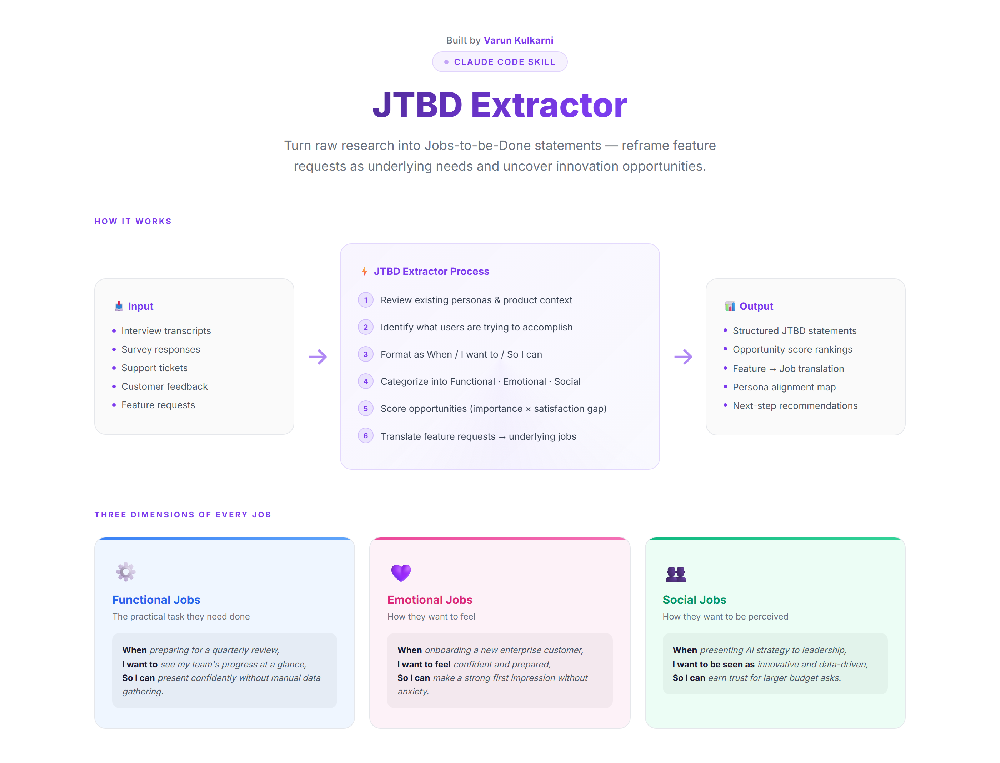

# 🎯 JTBD Extractor

> Turn raw research into Jobs-to-be-Done statements that reveal what users are really trying to accomplish — reframing feature requests as underlying needs and surfacing innovation opportunities worth pursuing.



[](#installation)
[](LICENSE)

---

## What It Does

The JTBD Extractor is a Claude Code skill that transforms unstructured research data (interviews, surveys, support tickets, feedback) into structured Jobs-to-be-Done analysis.

### Output Includes

| Component | Description |
|---|---|
| **JTBD Statements** | Properly formatted "When [situation], I want to [action], so I can [outcome]" |
| **Job Categories** | Separated into Functional, Emotional, and Social jobs |
| **Opportunity Scores** | `Importance + (Importance - Satisfaction)` to show where to focus |
| **Evidence Tracking** | Direct quotes and behavior supporting each job |
| **Feature Translation** | Mapping what users asked for → what they actually need |
| **Top Opportunities** | Ranked list of underserved jobs worth solving |

---

## Installation

### Claude Code Desktop
1. Clone or download this repo
2. Copy the folder to `~/.claude/skills/jtbd-extractor`
3. Restart Claude Code Desktop

### Claude Code Terminal
```bash
git clone https://github.com/varunk130/jtbd-extractor.git ~/.claude/skills/jtbd-extractor
```

### Project-Specific Use
Place in `.claude/skills/` within your project folder instead of the global location.

---

## Usage

In any Claude Code chat, type:

```
/jtbd-extractor
```

Claude will walk you through the process step-by-step:

1. **Reviews your context** — checks existing personas, product docs, and prior research
2. **Requests research data** — interview transcripts, surveys, support tickets, or feedback
3. **Identifies jobs** — extracts what users are really trying to accomplish
4. **Formats as JTBD** — structures each job as `When / I want to / So I can`
5. **Categorizes** — sorts into Functional, Emotional, and Social jobs
6. **Scores opportunities** — scores importance against satisfaction to surface unmet needs

---

## Example Output

```markdown
### Functional Jobs
| Job Statement | Importance | Satisfaction | Opportunity | Evidence |
|---|---|---|---|---|
| When preparing for a quarterly review, I want to see my team's progress at a glance, so I can present confidently without manual data gathering | 8/10 | 4/10 | 12 | "I spend 3 hours every quarter pulling numbers from 5 different tools" |

### Feature Request Translation
| Request (What They Said) | Job (What They Need) |
|---|---|
| "Add a dashboard" | "Know if I'm on track without manual checking" |
| "Export to PDF" | "Share progress with stakeholders who don't have access" |
```

---

## When to Use

- **Reframing feature requests** into underlying needs
- **Finding innovation opportunities** in saturated markets
- **Training your team** to think in jobs, not features
- **Post-interview synthesis** to extract structured insights
- **Competitive analysis** to find underserved jobs in the market

---

## What You'll Need

- Interview transcripts, survey responses, or customer feedback
- Context on your product/market (optional but recommended)

---

## Framework Reference

**Jobs-to-be-Done**:
- People don't buy products — they hire them to do a job
- Jobs are stable; solutions change
- **Opportunity = Importance + (Importance - Satisfaction)**

---

## Python CLI

Generate visual HTML, Markdown, or JSON reports from JTBD analysis data.

### Install

```bash
pip install -e .
```

### Usage

```bash
# Generate a visual HTML report (opens in browser)
jtbd examples/sample-data.json --open

# Generate Markdown
jtbd examples/sample-data.json -f markdown -o report.md

# Generate enriched JSON with computed scores
jtbd examples/sample-data.json -f json -o report.json
```

### Use as a Library

```python
from jtbd import Job, JTBDAnalysis, render_html

analysis = JTBDAnalysis(
    title="My JTBD Analysis",
    product_context="B2B SaaS platform",
    jobs=[
        Job(
            situation="preparing a quarterly review",
            action="see team progress at a glance",
            outcome="present confidently without manual data gathering",
            category="functional",
            importance=9, satisfaction=3,
            evidence='"I spend 3 hours pulling numbers from 5 tools."'
        ),
    ],
)

html = render_html(analysis, author="Your Name")
```

---

## Output Formats

| Format | Command | What You Get |
|---|---|---|
| **HTML** | `jtbd data.json` | Visual report with charts, cards, and scoring |
| **Markdown** | `jtbd data.json -f markdown` | Clean tables for docs/PRDs |
| **JSON** | `jtbd data.json -f json` | Enriched data with computed opportunity scores |

---

## File Structure

```
jtbd-extractor/
├── README.md                        # This file
├── SKILL.md                         # Claude Code skill definition
├── pyproject.toml                   # Python package config
├── docs/
│   └── jtbd-overview.html       # Interactive exec overview visual
├── jtbd/                            # Python package
│   ├── __init__.py
│   ├── models.py                    # Job, Translation, JTBDAnalysis data models
│   ├── renderer.py                  # HTML & Markdown report generators
│   └── cli.py                       # CLI entry point
├── examples/
│   ├── sample-data.json             # Sample input (JSON)
│   ├── sample-output.md             # Sample output (Markdown)
│   └── sample-output.html           # Sample output (visual HTML)
└── assets/
    └── jtbd-overview.png            # README screenshot
```

## Tips for Best Results

1. **Keep personas.md updated** — the skill connects new jobs to existing personas
2. **Focus on jobs, not solutions** — "I need a hole" not "Hire a drill"
3. **Look for emotional and social jobs** — they often drive decisions more than functional ones
4. **Validate scores quantitatively** — low-confidence scores from small samples need survey validation

Output is saved to: `discovery/outputs/jtbd-[persona]-[YYYY-MM-DD].md`

---

## License

MIT — use it however you want.

---

Built by [Varun Kulkarni](https://github.com/varunk130) — part of a portfolio of AI agent systems for product teams.
